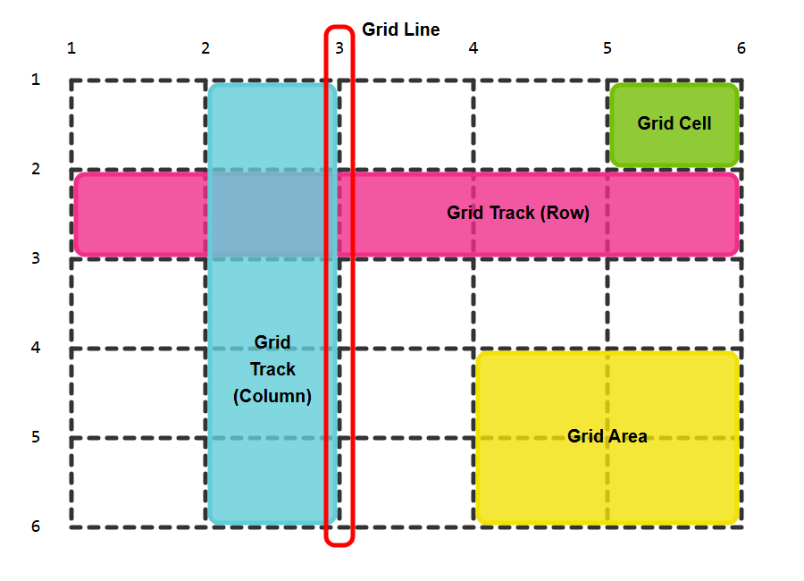

# CSS Grid Layout

CSS Grid Layout provides a powerful way to create flexible and responsive layouts. It allows for the placement of items in rows and columns, making it a two-dimensional layout system.

---

## **CSS Grid Basics**
To use Grid Layout, apply `display: grid` to the container element.

```css
.container {
  display: grid;
}
```

---

## **grid-template-columns** & **grid-template-rows**
Defines the number of columns and rows in the grid, and their sizes.

### **Syntax:**
```css
grid-template-columns: <track-size> ...;
grid-template-rows: <track-size> ...;
```

### **Example:**
```css
.container {
  display: grid;
  grid-template-columns: 100px 200px 1fr; /* 3 columns: fixed, fixed, flexible */
  grid-template-rows: 50px auto 100px;    /* 3 rows: fixed, flexible, fixed */
}
```

### **Track Sizes:**
- **Fixed size**: `px`, `em`, etc.
- **Flexible size**: `fr` (fraction of remaining space).
- **Auto**: Automatically adjusts size based on content.

---

## **grid-row** & **grid-column**
Specifies the start and end positions of a grid item.

### **Syntax:**
```css
grid-row: <start-line> / <end-line>;
grid-column: <start-line> / <end-line>;
```

### **Example:**
```css
.item {
  grid-row: 1 / 3;   /* Spans from row 1 to row 3 */
  grid-column: 2 / 4; /* Spans from column 2 to column 4 */
}
```

### **Shorthand Syntax:**
```css
grid-area: <row-start> / <column-start> / <row-end> / <column-end>;
```

### **Example:**
```css
.item {
  grid-area: 1 / 2 / 3 / 4; /* Combines grid-row and grid-column */
}
```

---

## **grid-template-areas**
Defines named grid areas for easier layout management.

### **Syntax:**
```css
grid-template-areas: "header header"
                     "sidebar main"
                     "footer footer";
```

### **Example:**
```css
.container {
  display: grid;
  grid-template-areas: 
    "header header"
    "sidebar main"
    "footer footer";
}

.header {
  grid-area: header;
}
.sidebar {
  grid-area: sidebar;
}
.main {
  grid-area: main;
}
.footer {
  grid-area: footer;
}
```

---

## **fr Unit**
The `fr` unit represents a fraction of the available space in the grid container.

### **Example:**
```css
.container {
  display: grid;
  grid-template-columns: 1fr 2fr 1fr; /* Divides space into 4 parts: 1, 2, 1 */
}
```

---

## **gap, row-gap, column-gap**
Controls the spacing between grid items.

### **gap**
Shorthand for `row-gap` and `column-gap`.

### **Syntax:**
```css
gap: <row-gap> <column-gap>;
```

### **row-gap** & **column-gap**
Define the spacing between rows and columns respectively.

### **Example:**
```css
.container {
  display: grid;
  grid-template-columns: 1fr 2fr 1fr;
  gap: 20px;            /* 20px gap between rows and columns */
  row-gap: 10px;        /* 10px gap between rows */
  column-gap: 15px;     /* 15px gap between columns */
}
```

---

These CSS Grid properties provide immense flexibility for creating robust and responsive layouts. Experiment with these features to design dynamic web pages!
